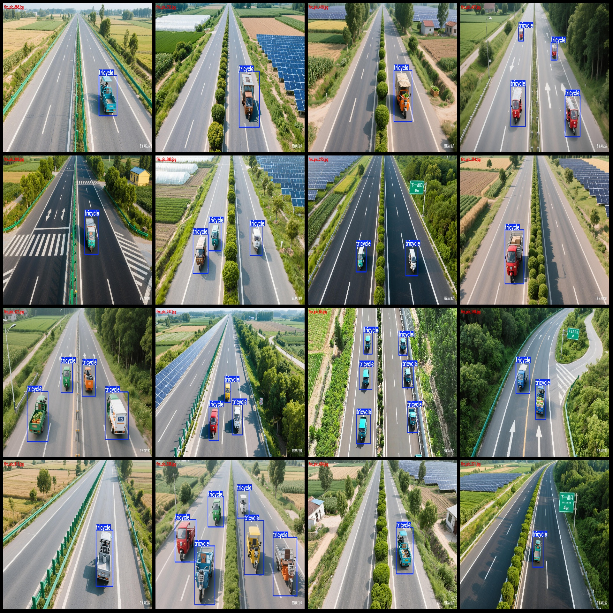
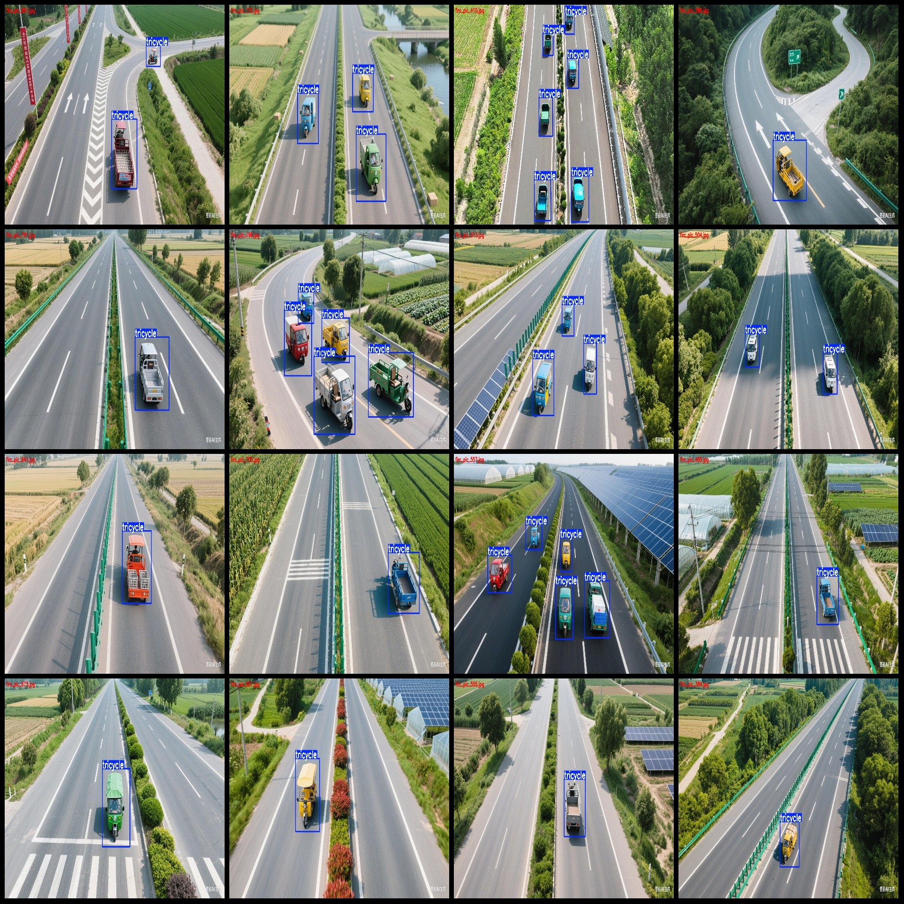
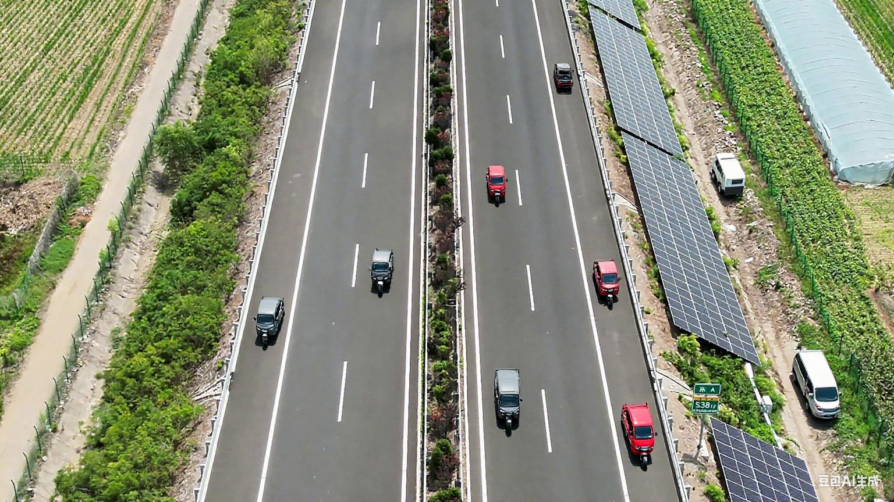

# Drone Perspective Aerial Photography Highway with Three-Wheeled Vehicle Detection Dataset VOC+YOLO Format: 976 Images, 1 Category

Dataset format: Pascal VOC format + YOLO format (txt file without segmentation path, only containing jpg images and corresponding VOC format xml files and YOLO format txt files)
Number of images (jpg file count): 976
Number of annotations (xml file count): 976
Number of annotations (txt file count): 976
Number of annotation categories: 1
Annotation category name: "tricycle"
Number of bounding boxes for each category:
- "tricycle": 2985
Total number of bounding boxes: 2985
Number of images per category:
- "tricycle": 976
Image resolution: 1536x864
Annotation tool used: labelImg
Annotation rules: draw a rectangular box around the category
Important note: The dataset does not have a requirement for division into training, validation, and test sets. Users need to divide it themselves.
Special declaration: This dataset does not guarantee the accuracy of the trained model or weight files.
Image preview:
Annotation example:
## Images

Here is a pay link on Stripe ( https://buy.stripe.com/3cs8yP7sY87d0vu9AB ). Please contact me lonlonago@foxmail.com after funding $89, and I will send you a complete data files , thank you!

